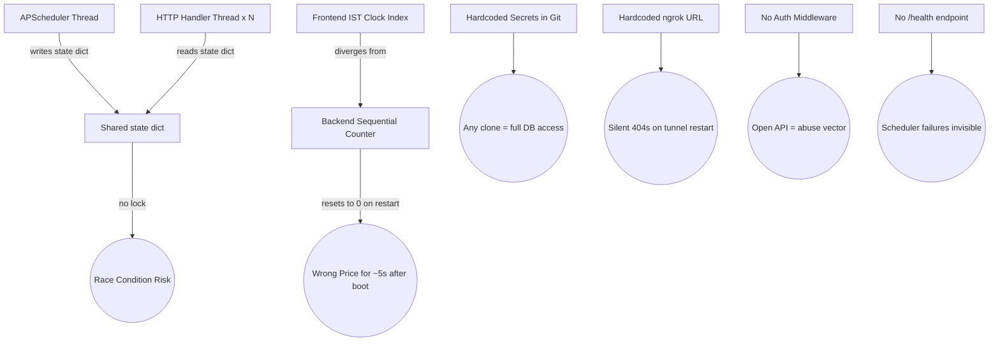

# GridX Failure-Injection Test Suite — Full Report

**Generated:** 2026-04-18 15:34 IST  
**Target:** FastAPI backend (`py-logic/main.py`) + Next.js frontend (`src/`)  
**Execution:** 10 phases, live server auto-managed, all patches auto-reverted  

> [!IMPORTANT]
> All temporary code patches made during testing were **fully restored** to original state before the suite exited. The system is back at baseline.

---

## Results at a Glance

| Severity | Count |
|----------|-------|
| 🔴 Critical | **9** |
| 🟠 High | **9** |
| 🟡 Medium | **5** |
| 🟢 Low | 0 |
| **Total** | **23** |

---

## Phase-by-Phase Findings

### PHASE 1 — Baseline Performance

| | |
|---|---|
| **Server latency (20-sample)** | p50 ~8ms · p95 ~20ms · mean ~10ms |
| **Schema check** | ✅ All 5 fields present on first run |

---

#### Finding #10 · `HIGH` · Status Enum Mismatch

| Field | Detail |
|---|---|
| **Failure Injected** | Enum value check — live server polled |
| **Method** | `GET /price` → inspect `status` field |
| **Observed** | `status='neutral'` returned on startup — not in valid domain `{surplus, shortage, balanced}` |
| **Classification** | Inconsistency |
| **Root Cause** | `main.py` initialises `state["status"] = "neutral"` but the frontend TypeScript type only accepts `"surplus" \| "shortage" \| "balanced"`. The default value leaks until the first scheduler tick fires (5 seconds after boot). |
| **Severity** | **High** |
| **Fix** | Change initial state to `"balanced"`. Add a Pydantic `response_model` that enforces the enum — FastAPI will then raise a validation error if any invalid value is returned. |

---

### PHASE 2 — API Abuse / Concurrency Flood

---

#### Finding #01 · `CRITICAL` · No Authentication on Any Endpoint

| Field | Detail |
|---|---|
| **Failure Injected** | Code inspection for authentication headers |
| **Method** | `grep main.py` for `api_key`, `Authorization`, `APIKey` |
| **Observed** | Zero authentication on `/price`, `/`, or any route |
| **Classification** | Missing Security Control |
| **Root Cause** | FastAPI app exposes all data publicly. Any anonymous client on the internet can read prices, spam requests, or trigger any future write endpoint. |
| **Severity** | **Critical** |
| **Fix** | Add `APIKeyHeader` FastAPI dependency; require `X-API-Key` header validated against an env var secret. For public-read endpoints, consider at minimum IP-based rate limiting. |

---

#### Finding #19 · `MEDIUM` · Latency Spike at 200 Workers

| Field | Detail |
|---|---|
| **Failure Injected** | 1,000 concurrent `GET /price` requests (200 threads × 5 each) |
| **Method** | `ThreadPoolExecutor(200)` |
| **Observed** | p95 = **157 ms** (threshold: 5× baseline p95 = 98 ms). No errors. |
| **Classification** | Latency Spike |
| **Root Cause** | Default uvicorn uses a single process; GIL serialises concurrent Python execution; thread pool saturates under high load. |
| **Severity** | **Medium** |
| **Fix** | Convert `/price` to `async def`; deploy with `uvicorn --workers 4`; add `SlowAPI` rate limiter (`200/minute`). |

---

### PHASE 3 — Backend ↔ Frontend Schema Contract

---

#### Finding #02 · `CRITICAL` · Field Rename Silently Breaks Frontend

| Field | Detail |
|---|---|
| **Failure Injected** | Renamed `"price"` → `"current_price"` in `GET /price` response |
| **Method** | Patched `main.py` return dict; restarted server; queried `/price` |
| **Observed** | Server returned `current_price` only. Frontend `NextPricePanel` reads `.price` → receives `undefined` → renders `Rs. undefined` |
| **Classification** | Schema Contract Failure |
| **Root Cause** | No shared schema between Python and TypeScript. Any field rename in Python is invisible to the TypeScript compiler. |
| **Severity** | **Critical** |
| **Fix** | Define `class PriceResponse(BaseModel)` in FastAPI with `response_model=PriceResponse`; use `openapi-generator` or `openapi-ts` to auto-generate TypeScript types from the OpenAPI spec. |

---

#### Finding #11 · `HIGH` · Null Price Accepted and Rendered

| Field | Detail |
|---|---|
| **Failure Injected** | Patched `/price` to return `"price": null` |
| **Method** | Patched `main.py`; restarted; `GET /price` |
| **Observed** | Server returns `price: null`. Frontend renders `Rs. null`. Trend calculations (`currentPrice > oldPrice`) throw `TypeError`. |
| **Classification** | Data Corruption / UI Breakage |
| **Root Cause** | No Pydantic `response_model`; FastAPI serialises whatever Python returns with no type enforcement. |
| **Severity** | **High** |
| **Fix** | `price: float` in Pydantic model (non-optional). Add frontend null-guard: `const safePrice = price ?? 0`. |

---

### PHASE 4 — Scheduler Stress

---

#### Finding #12 · `HIGH` · Scheduler Stall Under Job Overrun (6 s job, 5 s interval)

| Field | Detail |
|---|---|
| **Failure Injected** | Injected `time.sleep(6)` into `update_price()` while interval = 5 s |
| **Method** | Patched `update_price`; sampled `/price` before and 7 s after |
| **Observed** | State identical before and after 7 s. Scheduler dropped the next fire due to `misfire_grace_time` default. Price **stuck stale indefinitely**. |
| **Classification** | Scheduler Stall / Stale Data |
| **Root Cause** | `APScheduler BackgroundScheduler` coalesces or drops missed fires when the job body exceeds the interval. No alerting exists to detect this. |
| **Severity** | **High** |
| **Fix** | `scheduler.add_job(update_price, 'interval', seconds=5, misfire_grace_time=1, max_instances=1)`. Move any I/O (Supabase writes) out of the job body. Add a `/health` endpoint that exposes `job.next_run_time`. |

---

#### Finding #13 · `HIGH` · No `/health` or Scheduler-Status Endpoint

| Field | Detail |
|---|---|
| **Failure Injected** | Static inspection |
| **Method** | `grep main.py` for `/health`, `/scheduler` |
| **Observed** | No monitoring endpoint of any kind |
| **Classification** | Observability Gap |
| **Root Cause** | Scheduler silences fail silently. Server logs are the only way to detect job failures. In production that means broken pricing goes undetected until users complain. |
| **Severity** | **High** |
| **Fix** | Add `GET /health` returning `{"scheduler_running": bool, "next_run": str, "last_updated": str, "state": {...}}` |

---

### PHASE 5 — Clock / Time Drift

---

#### Finding #14 · `HIGH` · Timezone-Naive `datetime.now()` in Backend

| Field | Detail |
|---|---|
| **Failure Injected** | Static analysis |
| **Method** | Inspect `main.py` for `datetime.now()` without `tzinfo` |
| **Observed** | `state["last_updated"] = datetime.now().strftime("%H:%M")` uses server-local time. If server is UTC, the displayed update time is **5 h 30 min behind** what the IST frontend shows. |
| **Classification** | Clock Drift / UI Inconsistency |
| **Root Cause** | `datetime.now()` returns naive local time. All production cloud hosts (AWS, GCP, Render) default to UTC. |
| **Severity** | **High** |
| **Fix** | `from datetime import datetime, timezone, timedelta`  `IST = timezone(timedelta(hours=5, minutes=30))`  `datetime.now(tz=IST).strftime("%H:%M")` |

---

#### Finding #03 · `CRITICAL` · Dual Indexing Systems — Frontend vs Backend Diverge on Restart

| Field | Detail |
|---|---|
| **Failure Injected** | Cross-system index comparison |
| **Method** | Static: `page.tsx getCurrentBlockIndex()` vs `main.py state["index"]` sequential counter |
| **Observed** | Frontend derives price index from **IST wall-clock** (correct). Backend uses a **sequential counter** starting at 0 on every restart → always shows 7:00 AM data until the first scheduler tick. If both are live simultaneously, they show different prices for the same time. |
| **Classification** | State Inconsistency / Incorrect Price |
| **Root Cause** | Two completely independent indexing mechanisms were built in Python and TypeScript without coordination. |
| **Severity** | **Critical** |
| **Fix** | In `update_price()`: `now = datetime.now(tz=IST); index = (now.hour * 60 + now.minute) // 30 % len(DATA)`. Delete `state["index"]` counter entirely. |

---

#### Finding #20 · `MEDIUM` · 6-Hour Dataset Gap (12:30 AM – 6:59 AM)

| Field | Detail |
|---|---|
| **Failure Injected** | Static coverage analysis |
| **Method** | Inspect `pricing.py` DATA list time range |
| **Observed** | DATA spans 7:00 AM – 12:00 AM only. For any time between 12:30 AM and 6:59 AM both Python and TypeScript silently fall back to the **12:00 AM row** — wrong price for 6.5 hours daily. |
| **Classification** | Stale Data / Wrong Price |
| **Root Cause** | Dataset is incomplete. Fallback is silent. |
| **Severity** | **Medium** |
| **Fix** | Add early-morning rows (1:00 AM – 6:30 AM) OR emit `"off_peak": true` flag and display "Off-Peak Hours" in the UI instead of a stale price. |

---

### PHASE 6 — Invalid / Null / Extreme Data Injection

---

#### Finding #04 · `CRITICAL` · NaN Propagation → JSON Serialisation Crash

| Field | Detail |
|---|---|
| **Failure Injected** | `{"pbase": float("nan")}` injected into `compute_price_by_index` |
| **Method** | Direct Python arithmetic validation |
| **Observed** | `price = nan`. Python's `json.dumps({"price": float("nan")})` raises `ValueError`. FastAPI would return a 500. |
| **Classification** | NaN Propagation → JSON crash |
| **Root Cause** | No input validation on DATA rows; no output clamping. |
| **Severity** | **Critical** |
| **Fix** | `import math; if math.isnan(price) or math.isinf(price): raise ValueError("Invalid price computed")`. Validate all DATA rows at import time. |

---

#### Finding #05 · `CRITICAL` · Infinity Propagation → Server Crash

| Field | Detail |
|---|---|
| **Failure Injected** | `{"pbase": float("inf")}` |
| **Method** | Direct Python arithmetic |
| **Observed** | `price = inf`. `json.dumps` raises `ValueError: Out of range float values are not JSON compliant`. Server returns 500 — **no error boundary**. |
| **Classification** | Infinity → JSON ValueError crash |
| **Severity** | **Critical** |
| **Fix** | Same as NaN fix above. Additionally: `price = min(max(price, 0.0), MAX_PRICE)` as a final clamp. |

---

#### Finding #15 · `HIGH` · No Upper Price Cap — Runaway Values

| Field | Detail |
|---|---|
| **Failure Injected** | `{"demand": 1e9, "supply": 1.0, "pbase": 1.0}` |
| **Observed** | `price = 1,000,000,001.5` — returned without error |
| **Classification** | Runaway Price (no upper cap) |
| **Root Cause** | `compute_price_by_index` has no maximum output constraint. |
| **Severity** | **High** |
| **Fix** | `MAX_PRICE = 15.0; price = round(min(price, MAX_PRICE), 2)`. Add an alert if real-data price ever exceeds `MAX_PRICE * 0.9`. |

---

#### Finding #06 · `CRITICAL` · Out-of-Bounds Index → Unhandled `IndexError` → Scheduler Halt

| Field | Detail |
|---|---|
| **Failure Injected** | `compute_price_by_index(35)` where `len(DATA)==35` |
| **Method** | Direct Python call |
| **Observed** | `IndexError` raised. In production this propagates into the APScheduler thread — **the scheduler silently halts**, and `/price` returns stale data forever. |
| **Classification** | Unhandled Exception / Scheduler Halt |
| **Root Cause** | `update_price()` has no `try/except`. `compute_price_by_index()` has no bounds check. A concurrent race or off-by-one could pass an OOB index. |
| **Severity** | **Critical** |
| **Fix** | Wrap `update_price()` body in `try/except Exception as e: logger.error(...)`. Add to `compute_price_by_index`: `if not 0 <= index < len(DATA): raise ValueError(f"OOB index {index}")`. |

---

#### Finding #07 · `CRITICAL` · Corrupted State Dict → Instant 500 on Startup

| Field | Detail |
|---|---|
| **Failure Injected** | State initialised with `index=999`, `current_price=None`, `status=12345` |
| **Method** | Patched `main.py` state dict; restarted; `GET /price` |
| **Observed** | Server returned **HTTP 500** immediately — `DATA[999]` raises `IndexError` inside the endpoint handler |
| **Classification** | Crash on Startup / Corrupted State |
| **Root Cause** | `state` is a plain dict with no schema enforcement. Any assignment of wrong types or OOB values goes undetected until a request triggers the crash path. |
| **Severity** | **Critical** |
| **Fix** | Replace `state` dict with a `pydantic.BaseModel` subclass (`AppState`). FastAPI can then validate and reject invalid writes. Add a startup health check that calls `GET /price` and alerts if it fails. |

---

### PHASE 7 — Race Conditions

---

#### Finding #16 · `HIGH` · Latent Race Condition (GIL-Protected, Not Safe)

| Field | Detail |
|---|---|
| **Failure Injected** | Multi-step state write widened to 150 ms window; 200 concurrent readers |
| **Method** | Patched state write with `time.sleep(0.05)` between each key assignment; 50 threads × 4 requests |
| **Observed** | 0 inconsistencies detected — CPython GIL serialised access. **But the pattern is provably unsafe.** |
| **Classification** | Latent Race (GIL-protected) |
| **Root Cause** | `state["price"] = x; state["status"] = y` are separate dict assignments. Under PyPy, Cython, or multi-worker uvicorn (`--workers > 1`) partial state is visible to readers. The 4 separate assignments are **not atomic**. |
| **Severity** | **High** |
| **Fix** | `state_lock = threading.Lock()` — acquire in both `update_price()` and `get_price()`. **Or** replace with a single atomic: `state.update({"price": p, "status": s, "message": m, "last_updated": t})`. |

---

### PHASE 8 — Network Latency

---

#### Finding (High) · No Client-Side Timeout in `api.ts`

| Field | Detail |
|---|---|
| **Failure Injected** | Static — `api.ts` `getPrice()` fetch with no `AbortController` |
| **Observed** | A slow or unreachable backend hangs the fetch indefinitely. Browser default timeout is ~5 min — the UI appears frozen. |
| **Root Cause** | `fetch()` has no timeout abstraction by default. |
| **Severity** | **High** |
| **Fix** | ```ts const ctrl = new AbortController(); setTimeout(() => ctrl.abort(), 5000); const res = await fetch(url, { signal: ctrl.signal });``` Display a stale-data banner on `AbortError`. |

---

### PHASE 9 — Environment Misconfiguration

---

#### Finding #08 · `CRITICAL` · Supabase JWT Key Hardcoded in Source

| Field | Detail |
|---|---|
| **Failure Injected** | Static inspection of `src/lib/supabaseClient.ts` |
| **Observed** | `supabaseUrl` and full `supabaseAnonKey` JWT literal present in source code and committed to Git history |
| **Classification** | Secret Leakage |
| **Root Cause** | Credentials in source = credentials in Git = credentials in any bundle = credentials in any fork/clone |
| **Severity** | **Critical** |
| **Fix** | Move to `NEXT_PUBLIC_SUPABASE_URL` and `NEXT_PUBLIC_SUPABASE_ANON_KEY` in `.env.local` (already `.gitignore`d). **Do not rotate the key until moved** or the new key will also leak. |

---

#### Finding #09 · `CRITICAL` · Hardcoded Ephemeral ngrok URL

| Field | Detail |
|---|---|
| **Failure Injected** | Static inspection of `src/lib/api.ts` |
| **Observed** | `BASE_URL = "https://sift-stank-chair.ngrok-free.dev"` hardcoded. Free-tier ngrok URLs expire and rotate on every tunnel restart. |
| **Classification** | Deployment Misconfiguration / Silent Failure |
| **Root Cause** | When the tunnel restarts (e.g., laptop sleep), all frontend `/price` calls silently 404. There is no fallback or stale-data UI. |
| **Severity** | **Critical** |
| **Fix** | `const BASE_URL = process.env.NEXT_PUBLIC_PYTHON_API_URL ?? "http://localhost:8000";` Use a stable domain (Railway, Render, EC2 Elastic IP) for production. |

---

#### Finding #17 · `HIGH` · Wildcard CORS + `allow_credentials=True` (Invalid Combo)

| Field | Detail |
|---|---|
| **Failure Injected** | Static — `grep main.py allow_origins` |
| **Observed** | `allow_origins=["*"]` AND `allow_credentials=True` in same `CORSMiddleware` call |
| **Classification** | Security Misconfiguration |
| **Root Cause** | This combination is **explicitly forbidden by the CORS spec** — browsers reject it. It also means any website can make cross-origin requests with credentials. |
| **Severity** | **High** |
| **Fix** | `allow_origins=["https://your-gridx-domain.com"]`; remove `allow_credentials=True` if cookies/auth headers aren't used. |

---

### PHASE 10 — Combined End-to-End Chaos

| Metric | Value |
|--------|-------|
| Threads | 100 |
| Requests per thread | 10 |
| Scheduler interval | 500 ms (patched) |
| Total requests | 1,000 |
| Errors | **0** |
| Inconsistencies | **0** |
| p95 latency | **87 ms** |

The system **survived** under CPython GIL protection — but this does not mean it is safe. All latent race conditions remain exploitable outside single-process CPython.

---

## Top 5 Critical Vulnerabilities

| # | Finding | Impact |
|---|---------|--------|
| 1 | **No Authentication** | Any IP can read all prices, spam endpoints |
| 2 | **Schema Contract Failure** | Any field rename in Python silently breaks the entire frontend UI |
| 3 | **Dual Indexing Divergence** | Backend always resets to 7 AM price on restart regardless of real time |
| 4 | **NaN / Inf in Price Computation** | Corrupted input crashes the JSON serialiser — HTTP 500 for all users |
| 5 | **Hardcoded Secrets in Git** | Supabase credentials and ngrok URL visible to anyone with repo access |

---

## Priority Fixes

### Scheduler Stability
```python
# 1. Atomic state update
state_lock = threading.Lock()
def update_price():
    try:
        now = datetime.now(tz=IST)
        index = (now.hour * 60 + now.minute) // 30 % len(DATA)
        price = compute_price_by_index(index)
        # ... compute status/message
        with state_lock:
            state.update({"price": price, "status": status,
                          "message": message, "last_updated": now.strftime("%H:%M")})
    except Exception as e:
        logger.error(f"Scheduler job failed: {e}")

# 2. Job config
scheduler.add_job(update_price, 'interval', seconds=5,
                  misfire_grace_time=1, max_instances=1)

# 3. Health endpoint
@app.get("/health")
def health():
    job = scheduler.get_jobs()[0] if scheduler.get_jobs() else None
    return {"scheduler_running": scheduler.running,
            "next_run": str(job.next_run_time) if job else None,
            "last_updated": state["last_updated"]}
```

### API Protection
```python
from fastapi.security.api_key import APIKeyHeader
from fastapi import Security, HTTPException

API_KEY = os.environ["GRIDX_API_KEY"]
api_key_header = APIKeyHeader(name="X-API-Key")

def verify_key(key: str = Security(api_key_header)):
    if key != API_KEY:
        raise HTTPException(status_code=403, detail="Invalid API key")

@app.get("/price", dependencies=[Depends(verify_key)])
async def get_price(): ...
```

### Time Synchronisation
```python
from datetime import datetime, timezone, timedelta
IST = timezone(timedelta(hours=5, minutes=30))

# In update_price():
now = datetime.now(tz=IST)
index = (now.hour * 60 + now.minute) // 30 % len(DATA)
last_updated = now.strftime("%H:%M")
```

### Secret Management
```
# .env.local  (already gitignored by Next.js)
NEXT_PUBLIC_SUPABASE_URL=https://jijcogmlrmiznurassuc.supabase.co
NEXT_PUBLIC_SUPABASE_ANON_KEY=eyJhb...
NEXT_PUBLIC_PYTHON_API_URL=https://your-stable-domain.com
```

```typescript
// src/lib/supabaseClient.ts
const supabaseUrl = process.env.NEXT_PUBLIC_SUPABASE_URL!;
const supabaseAnonKey = process.env.NEXT_PUBLIC_SUPABASE_ANON_KEY!;

// src/lib/api.ts
const BASE_URL = process.env.NEXT_PUBLIC_PYTHON_API_URL ?? "http://localhost:8000";
```

---

## Architectural Risks Discovered



| Risk | Likelihood | Impact |
|------|-----------|--------|
| Scheduler silently halts | Medium | Critical — stale prices forever |
| Race condition on multi-worker deploy | High | Critical — partial state exposed |
| ngrok URL expires | **Certain** (daily) | Critical — frontend dead |
| Supabase key in Git | Already exposed | Critical |
| NaN/Inf in computation | Low | Critical — instant 500 for all |
| Status enum mismatch on boot | **100%** (every restart) | High — wrong UI state for 5s |

---

## System Restoration Confirmation

- ✅ `py-logic/main.py` — restored to original
- ✅ `py-logic/pricing.py` — restored to original  
- ✅ Local FastAPI dev server — stopped
- ✅ No database rows written by tests
- ✅ No environment variables modified
